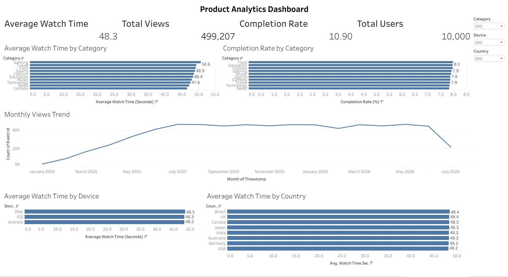

# 📊 Product Analytics Case Study

An end-to-end Product Analytics project built using Python, SQL, Machine Learning, and Tableau to analyze user engagement on a short-video platform.

## Dashboard Preview



---

## Project Highlights

- Generated a synthetic dataset with over 680,000 user interaction events.
- Performed SQL-based product analytics to evaluate engagement metrics.
- Built an interactive Tableau dashboard with KPI cards and dynamic filters.
- Developed a machine learning model to predict video completion.
- Created an end-to-end analytics workflow from data generation to visualization.

## Project Overview

This project simulates user interaction data from a short-video platform and analyzes user behavior using SQL and Tableau. A machine learning model is also developed to predict whether a user is likely to complete watching a video.

The project demonstrates a complete analytics workflow, including:

- Data generation using Python
- Data cleaning and preprocessing
- Exploratory Data Analysis (EDA)
- SQL-based analytics
- Machine Learning prediction
- Interactive Tableau dashboard

---

## Tech Stack

- Python
- SQL (MySQL)
- Tableau
- Pandas
- NumPy
- Scikit-learn
- Faker

---

## Project Workflow

1. Generate synthetic product analytics data
2. Clean and preprocess the dataset
3. Perform SQL analysis
4. Build a Machine Learning classification model
5. Create an interactive Tableau dashboard
6. Generate insights and recommendations

---

## Dashboard KPIs

- Total Views
- Average Watch Time
- Completion Rate
- Total Users
- Monthly Views Trend
- Average Watch Time by Category
- Completion Rate by Category
- Average Watch Time by Device
- Average Watch Time by Country

---

## Machine Learning

A classification model was developed using Scikit-learn to predict whether a user would complete watching a video based on user behavior and video characteristics.

Target:
- Watch Completed

Example Features:
- Watch Time
- Video Duration
- Device
- Category
- Premium User
- Verified Creator

## Repository Structure

```
Product-Analytics-Case-Study/
│
├── data/
├── images/
├── notebooks/
├── sql/
├── Tableau/
├── README.md
└── requirements.txt
```

---

## Key Insights

- Gaming videos have the highest average watch time.
- Average watch time remains consistent across devices.
- User engagement is similar across countries.
- Monthly views remain relatively stable after initial growth.
- Completion rates are consistent across content categories.

---

## Author

**Disha Basavaraju**

MS in Analytics  
University of Southern California
- GitHub: https://github.com/dbasavar25
- LinkedIn: https://www.linkedin.com/in/disha-basavaraju-8792a0241
